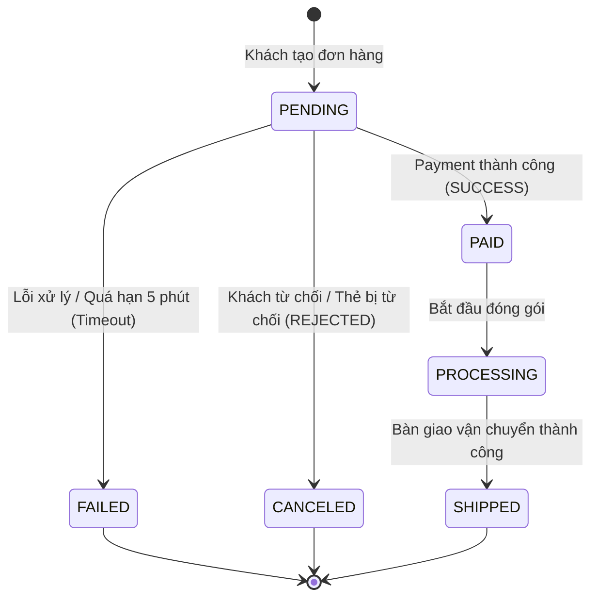

### 1. Phân tích & Giải quyết yêu cầu

#### a) Vị trí cập nhật trạng thái đơn hàng

* **Vị trí hiện tại:** Đoạn code nằm trong `@EventListener handlePaymentResponse(PaymentResponseEvent event)` là nơi tiếp nhận sự kiện từ Payment Service.
* **Vấn đề cốt lõi:** Nếu mạng bị đứt ngay thời điểm phản hồi, event listener sẽ không bao giờ được kích hoạt, khiến đơn hàng kẹt mãi ở trạng thái `PENDING`. Ngoài ra, cần bổ sung cơ chế kiểm tra trạng thái hiện tại (tính Idempotency) để tránh cập nhật đè khi sự kiện bị gửi trùng lặp.
* **Giải pháp vị trí:**
1. *Luồng thời gian thực (Real-time path):* Giữ listener để cập nhật trạng thái ngay khi có event về.
2. *Luồng bù trừ dữ liệu (Reconciliation / Timeout path):* Bổ sung một Scheduled Task (cron job) quét định kỳ các đơn hàng `PENDING` quá hạn (quá 5 phút). Job này sẽ chủ động truy vấn (poll) sang Payment Service để xác nhận trạng thái thực tế hoặc đánh dấu hủy/thất bại nếu giao dịch thực sự không tồn tại.


#### b) Sửa logic xử lý phản hồi và xử lý Timeout

* `SUCCESS` $\rightarrow$ `PAID`.
* `REJECTED` $\rightarrow$ `CANCELED` (hoặc `FAILED`), đồng thời kích hoạt bù trừ hoàn kho (Compensating transaction).
* `Timeout / Mất kết nối` $\rightarrow$ Scheduled Job quét các đơn `PENDING` tạo trước mốc 5 phút:
* Gọi sang Payment Service kiểm tra: Nếu đã thanh toán $\rightarrow$ đồng bộ `PAID`. Nếu chưa thanh toán/không tìm thấy giao dịch $\rightarrow$ chuyển `FAILED`/`CANCELED` và giải phóng tài nguyên.


---

### 2. Sơ đồ trạng thái đơn hàng (State Machine)

#### Sơ đồ Mermaid:



#### Giải thích các điều kiện chuyển đổi:

* **`[*] -> PENDING`:** Đơn hàng vừa khởi tạo, đang chờ kết quả thanh toán từ Payment Service.
* **`PENDING -> PAID`:** Khi `handlePaymentResponse` nhận được sự kiện `SUCCESS` hoặc khi Scheduled Job truy vấn thấy bên Payment đã trừ tiền thành công.
* **`PENDING -> CANCELED`:** Khi nhận sự kiện `REJECTED` (ví dụ: số dư không đủ, khách hủy giao dịch).
* **`PENDING -> FAILED`:** Khi hệ thống Payment báo lỗi kỹ thuật (`FAILED`) hoặc Scheduled Job quét thấy đơn ở trạng thái `PENDING` quá 5 phút mà không xác thực được thanh toán.
* **`PAID -> PROCESSING -> SHIPPED`:** Các trạng thái mở rộng của quy trình fulfillment sau khi đã thanh toán thành công.

---

### 3. Source Code hoàn chỉnh (Spring Boot)

#### Model và Enum trạng thái:

```java
package com.example.orderservice.model;

public enum OrderStatus {
    PENDING,
    PAID,
    CANCELED,
    FAILED,
    SHIPPED
}

```

```java
package com.example.orderservice.model;

import jakarta.persistence.*;
import lombok.*;
import java.time.LocalDateTime;

@Entity
@Table(name = "orders")
@Getter
@Setter
@NoArgsConstructor
@AllArgsConstructor
@Builder
public class Order {
    @Id
    private String id;
    
    @Enumerated(EnumType.STRING)
    private OrderStatus status;
    
    private LocalDateTime createdAt;
    private LocalDateTime updatedAt;
}

```

#### Repository:

```java
package com.example.orderservice.repository;

import com.example.orderservice.model.Order;
import com.example.orderservice.model.OrderStatus;
import org.springframework.data.jpa.repository.JpaRepository;
import org.springframework.stereotype.Repository;

import java.time.LocalDateTime;
import java.util.List;

@Repository
public interface OrderRepository extends JpaRepository<Order, String> {
    // Tìm các đơn hàng PENDING tạo trước một mốc thời gian nhất định (ví dụ trước 5 phút)
    List<Order> findByStatusAndCreatedAtBefore(OrderStatus status, LocalDateTime time);
}

```

#### Event Listener & Scheduled Job:

```java
package com.example.orderservice.service;

import com.example.orderservice.dto.PaymentResponseEvent;
import com.example.orderservice.exception.OrderNotFoundException;
import com.example.orderservice.model.Order;
import com.example.orderservice.model.OrderStatus;
import com.example.orderservice.repository.OrderRepository;
import lombok.RequiredArgsConstructor;
import lombok.extern.slf4j.Slf4j;
import org.springframework.context.event.EventListener;
import org.springframework.scheduling.annotation.Scheduled;
import org.springframework.stereotype.Service;
import org.springframework.transaction.annotation.Transactional;

import java.time.LocalDateTime;
import java.util.List;

@Service
@RequiredArgsConstructor
@Slf4j
public class OrderSyncService {

    private final OrderRepository orderRepository;
    private final PaymentClient paymentClient; // FeignClient hoặc RestClient gọi sang Payment Service

    /**
     * a & b) Xử lý phản hồi real-time từ Payment Service
     */
    @EventListener
    @Transactional
    public void handlePaymentResponse(PaymentResponseEvent event) {
        Order order = orderRepository.findById(event.getOrderId())
                .orElseThrow(() -> new OrderNotFoundException(event.getOrderId()));

        // Idempotency check: Chỉ xử lý nếu đơn đang PENDING
        if (order.getStatus() != OrderStatus.PENDING) {
            log.warn("Đơn hàng {} đã ở trạng thái {}, bỏ qua sự kiện trùng lặp.", order.getId(), order.getStatus());
            return;
        }

        switch (event.getStatus()) {
            case "SUCCESS":
                order.setStatus(OrderStatus.PAID);
                order.setUpdatedAt(LocalDateTime.now());
                orderRepository.save(order);
                log.info("Cập nhật đơn hàng {} sang trạng thái PAID", order.getId());
                // Gửi event/message qua Kafka cho Shipping hoặc Notification Service
                break;

            case "REJECTED":
                order.setStatus(OrderStatus.CANCELED);
                order.setUpdatedAt(LocalDateTime.now());
                orderRepository.save(order);
                log.info("Cập nhật đơn hàng {} sang trạng thái CANCELED", order.getId());
                // Kích hoạt Saga Compensating: hoàn lại tồn kho
                break;

            case "FAILED":
            default:
                order.setStatus(OrderStatus.FAILED);
                order.setUpdatedAt(LocalDateTime.now());
                orderRepository.save(order);
                log.warn("Đơn hàng {} thanh toán thất bại, chuyển sang FAILED", order.getId());
                break;
        }
    }

    /**
     * b) Scheduled job: Xử lý timeout/mất gói tin
     * Chạy định kỳ mỗi 60 giây để quét các đơn PENDING quá 5 phút
     */
    @Scheduled(fixedDelay = 60000)
    @Transactional
    public void reconcilePendingOrders() {
        LocalDateTime expirationThreshold = LocalDateTime.now().minusMinutes(5);
        List<Order> stuckOrders = orderRepository.findByStatusAndCreatedAtBefore(OrderStatus.PENDING, expirationThreshold);

        for (Order order : stuckOrders) {
            log.info("Phát hiện đơn hàng lạc lối: {}, đang xác thực với Payment Service...", order.getId());

            try {
                // Chủ động query sang Payment Service để đối soát
                String paymentStatus = paymentClient.checkPaymentStatus(order.getId());

                if ("SUCCESS".equalsIgnoreCase(paymentStatus)) {
                    // Tình huống đề bài: Payment đã trừ tiền nhưng Order bị mất kết nối
                    order.setStatus(OrderStatus.PAID);
                    order.setUpdatedAt(LocalDateTime.now());
                    orderRepository.save(order);
                    log.info("Đã đồng bộ lại đơn hàng {} thành PAID từ Payment Service", order.getId());
                } else {
                    // Không thanh toán hoặc giao dịch thất bại
                    order.setStatus(OrderStatus.FAILED);
                    order.setUpdatedAt(LocalDateTime.now());
                    orderRepository.save(order);
                    log.warn("Đơn hàng {} quá hạn 5 phút và không thanh toán, chuyển sang FAILED", order.getId());
                }
            } catch (Exception ex) {
                log.error("Lỗi khi kiểm tra trạng thái đơn hàng {}: {}", order.getId(), ex.getMessage());
            }
        }
    }
}

```