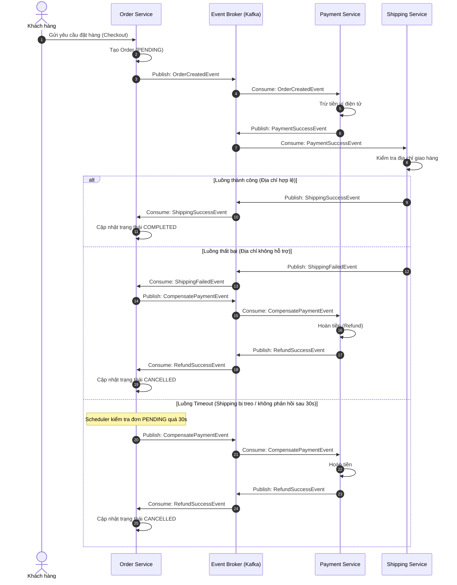
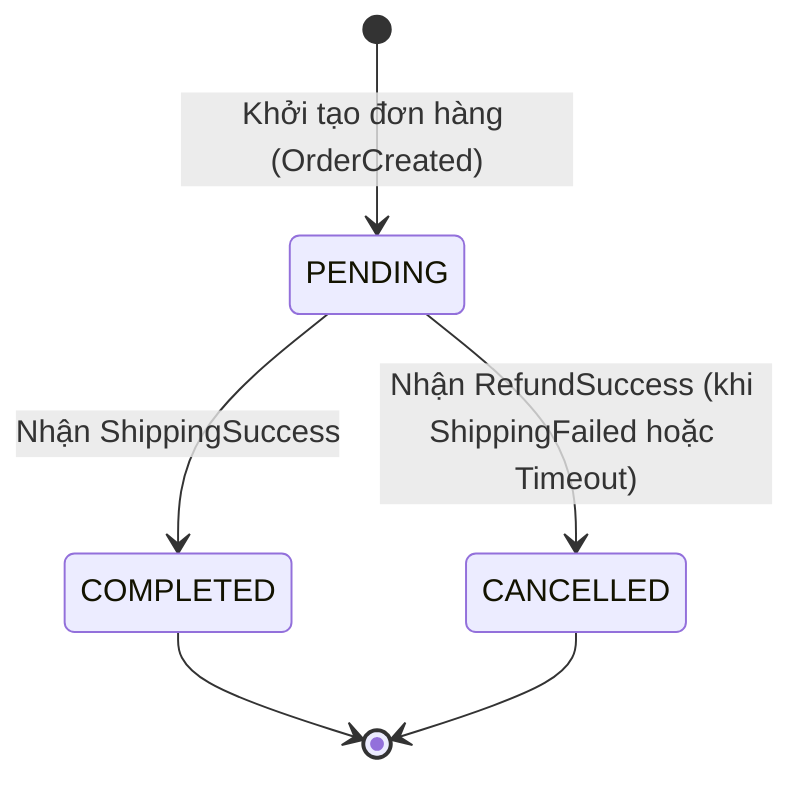

# BÁO CÁO THIẾT KẾ VÀ TRIỂN KHAI VŨ ĐIỆU CHOREOGRAPHY SAGA

---

## 1. Phân tích Input / Output của quy trình

### 1.1. Input (Dữ liệu đầu vào khi khởi tạo đơn)

* **Khách hàng (`customerInfo`):** `customerId`, `name`, `shippingAddress` (địa chỉ nhận hàng).
* **Đơn hàng (`orderInfo`):** `orderId`, `items` (danh sách sản phẩm, số lượng), `totalAmount` (tổng số tiền cần thanh toán).
* **Số dư ví (`walletBalance`):** Số dư hiện tại của khách hàng trong hệ thống Payment Service.

### 1.2. Output (Trạng thái cuối cùng của 3 Service)

| Service | Luồng thành công (Happy Path) | Luồng Shipping thất bại / Timeout (Compensating Path) |
| --- | --- | --- |
| **Order Service** | Đơn hàng chuyển trạng thái **`COMPLETED`** (hoặc `CONFIRMED`). | Đơn hàng chuyển trạng thái **`CANCELLED`**. |
| **Payment Service** | Giao dịch trừ tiền thành công (**`PAID`**), số dư ví bị trừ `totalAmount`. | Giao dịch thanh toán được hoàn tiền (**`REFUNDED`**), số dư ví được cộng lại `totalAmount`. |
| **Shipping Service** | Vận đơn được tạo thành công (**`DELIVERY_CREATED`**), mã vận đơn `waybillId` được cấp phát. | Không có vận đơn nào được tạo (**`DELIVERY_REJECTED`** / **`FAILED`**). |

---

## 2. Lưu đồ quy trình (Flowchart & Sequence Diagram)

### 2.1. Sequence Diagram: Choreography Saga Flow



### 2.2. State Machine chuyển đổi trạng thái của Order



---

## 3. Thiết kế giải pháp kỹ thuật & Cơ chế Timeout (30s)

### 3.1. Danh sách Kafka Topics & Events

* `order-events`: Chứa `OrderCreatedEvent`, `CompensatePaymentEvent`.
* `payment-events`: Chứa `PaymentSuccessEvent`, `PaymentFailedEvent`, `RefundSuccessEvent`.
* `shipping-events`: Chứa `ShippingSuccessEvent`, `ShippingFailedEvent`.

### 3.2. Cơ chế xử lý Timeout (30 giây)

Do Choreography Saga phân tán và không có coordinator tập trung, Order Service sẽ đóng vai trò tự giám sát vòng đời đơn hàng:

* **Lưu mốc thời gian:** Khi đơn hàng chuyển sang chờ phản hồi giao hàng, cập nhật `last_status_updated_at = NOW()`.
* **Scheduled Dead-letter / Timeout Job:** Mỗi 5–10 giây, một background task chạy truy vấn:

$$\text{status} = \text{'PENDING'} \quad \text{AND} \quad \text{last\_status\_updated\_at} < \text{NOW}() - 30\text{s}$$


* **Hành động khi Timeout:** Khi phát hiện đơn bị timeout:
1. Đánh dấu cờ nội bộ `is_timeout = true`.
2. Bắn ngay sự kiện `CompensatePaymentEvent` lên Kafka để Payment Service hoàn tiền.
3. Khi Shipping phản hồi trễ sau đó, Order Service kiểm tra trạng thái đơn đã `CANCELLED` thì sẽ hủy vận đơn đó (Idempotent handling).


---

## 4. Mã nguồn mô phỏng hoàn chỉnh (Spring Boot + Apache Kafka)

### 4.1. Định nghĩa DTO Events (Shared Library hoặc Package dùng chung)

```java
package com.example.saga.dto;

import lombok.AllArgsConstructor;
import lombok.Builder;
import lombok.Data;
import lombok.NoArgsConstructor;
import java.io.Serializable;
import java.math.BigDecimal;

@Data
@Builder
@NoArgsConstructor
@AllArgsConstructor
public class SagaEvent implements Serializable {
    private String eventType; // ORDER_CREATED, PAYMENT_SUCCESS, SHIPPING_FAILED, COMPENSATE_PAYMENT, REFUND_SUCCESS, etc.
    private String orderId;
    private String customerId;
    private BigDecimal amount;
    private String shippingAddress;
    private String failureReason;
}

```

---

### 4.2. Order Service

#### Entity:

```java
package com.example.orderservice.entity;

import jakarta.persistence.*;
import lombok.*;
import java.math.BigDecimal;
import java.time.LocalDateTime;

@Entity
@Table(name = "orders")
@Getter @Setter @NoArgsConstructor @AllArgsConstructor @Builder
public class Order {
    @Id
    private String orderId;
    private String customerId;
    private BigDecimal totalAmount;
    private String shippingAddress;
    
    @Enumerated(EnumType.STRING)
    private OrderStatus status; // PENDING, COMPLETED, CANCELLED
    
    private LocalDateTime updatedAt;
}

```

#### Order Service & Event Listener:

```java
package com.example.orderservice.service;

import com.example.orderservice.entity.Order;
import com.example.orderservice.entity.OrderStatus;
import com.example.orderservice.repository.OrderRepository;
import com.example.saga.dto.SagaEvent;
import lombok.RequiredArgsConstructor;
import lombok.extern.slf4j.Slf4j;
import org.springframework.kafka.annotation.KafkaListener;
import org.springframework.kafka.core.KafkaTemplate;
import org.springframework.scheduling.annotation.Scheduled;
import org.springframework.stereotype.Service;
import org.springframework.transaction.annotation.Transactional;

import java.math.BigDecimal;
import java.time.LocalDateTime;
import java.util.List;
import java.util.UUID;

@Service
@RequiredArgsConstructor
@Slf4j
public class OrderService {

    private final OrderRepository orderRepository;
    private final KafkaTemplate<String, Object> kafkaTemplate;

    // 1. Tạo đơn hàng mới
    @Transactional
    public Order createOrder(String customerId, BigDecimal amount, String address) {
        String orderId = UUID.randomUUID().toString();
        Order order = Order.builder()
                .orderId(orderId)
                .customerId(customerId)
                .totalAmount(amount)
                .shippingAddress(address)
                .status(OrderStatus.PENDING)
                .updatedAt(LocalDateTime.now())
                .build();
        orderRepository.save(order);

        // Phát sự kiện OrderCreated
        SagaEvent event = SagaEvent.builder()
                .eventType("ORDER_CREATED")
                .orderId(orderId)
                .customerId(customerId)
                .amount(amount)
                .shippingAddress(address)
                .build();

        kafkaTemplate.send("order-events", orderId, event);
        log.info("[OrderService] Đã tạo đơn hàng: {} (PENDING)", orderId);
        return order;
    }

    // 2. Nhận ShippingSuccess -> Hoàn tất đơn
    @KafkaListener(topics = "shipping-events", groupId = "order-group")
    @Transactional
    public void handleShippingEvents(SagaEvent event) {
        if ("SHIPPING_SUCCESS".equals(event.getEventType())) {
            orderRepository.findById(event.getOrderId()).ifPresent(order -> {
                if (order.getStatus() == OrderStatus.PENDING) {
                    order.setStatus(OrderStatus.COMPLETED);
                    order.setUpdatedAt(LocalDateTime.now());
                    orderRepository.save(order);
                    log.info("[OrderService] Đơn hàng {} hoàn tất thành công (COMPLETED)", order.getOrderId());
                }
            });
        } else if ("SHIPPING_FAILED".equals(event.getEventType())) {
            // Bước c: Shipping gửi ShippingFailed -> Order nhận và gửi CompensatePayment
            log.warn("[OrderService] Vận chuyển đơn {} thất bại. Bắt đầu kích hoạt bù trừ Payment!", event.getOrderId());
            triggerPaymentCompensation(event.getOrderId(), event.getCustomerId(), event.getAmount());
        }
    }

    // 3. Nhận RefundSuccess từ Payment -> Hủy đơn
    @KafkaListener(topics = "payment-events", groupId = "order-group")
    @Transactional
    public void handlePaymentEvents(SagaEvent event) {
        if ("REFUND_SUCCESS".equals(event.getEventType())) {
            orderRepository.findById(event.getOrderId()).ifPresent(order -> {
                order.setStatus(OrderStatus.CANCELLED);
                order.setUpdatedAt(LocalDateTime.now());
                orderRepository.save(order);
                log.info("[OrderService] Đã nhận thông báo hoàn tiền. Hủy đơn hàng {} (CANCELLED)", order.getOrderId());
            });
        }
    }

    private void triggerPaymentCompensation(String orderId, String customerId, BigDecimal amount) {
        SagaEvent compensateEvent = SagaEvent.builder()
                .eventType("COMPENSATE_PAYMENT")
                .orderId(orderId)
                .customerId(customerId)
                .amount(amount)
                .build();
        kafkaTemplate.send("order-events", orderId, compensateEvent);
    }

    // d) Scheduled Job quét đơn hàng quá hạn 30 giây
    @Scheduled(fixedDelay = 5000)
    @Transactional
    public void handleOrderTimeouts() {
        LocalDateTime timeoutThreshold = LocalDateTime.now().minusSeconds(30);
        List<Order> stuckOrders = orderRepository.findByStatusAndUpdatedAtBefore(OrderStatus.PENDING, timeoutThreshold);

        for (Order order : stuckOrders) {
            log.error("[OrderService] Đơn hàng {} bị timeout sau 30s không nhận được phản hồi Shipping. Bù trừ ngay!", order.getOrderId());
            // Cập nhật updatedAt để tránh quét lại nhiều lần
            order.setUpdatedAt(LocalDateTime.now());
            orderRepository.save(order);
            triggerPaymentCompensation(order.getOrderId(), order.getCustomerId(), order.getTotalAmount());
        }
    }
}

```

---

### 4.3. Payment Service

```java
package com.example.paymentservice.service;

import com.example.saga.dto.SagaEvent;
import lombok.RequiredArgsConstructor;
import lombok.extern.slf4j.Slf4j;
import org.springframework.kafka.annotation.KafkaListener;
import org.springframework.kafka.core.KafkaTemplate;
import org.springframework.stereotype.Service;

@Service
@RequiredArgsConstructor
@Slf4j
public class PaymentService {

    private final KafkaTemplate<String, Object> kafkaTemplate;

    @KafkaListener(topics = "order-events", groupId = "payment-group")
    public void handleOrderEvents(SagaEvent event) {
        if ("ORDER_CREATED".equals(event.getEventType())) {
            // Thực hiện trừ tiền
            log.info("[PaymentService] Đang trừ {} VND của khách hàng {}", event.getAmount(), event.getCustomerId());
            
            // Giả lập trừ tiền thành công
            SagaEvent successEvent = SagaEvent.builder()
                    .eventType("PAYMENT_SUCCESS")
                    .orderId(event.getOrderId())
                    .customerId(event.getCustomerId())
                    .amount(event.getAmount())
                    .shippingAddress(event.getShippingAddress())
                    .build();
            kafkaTemplate.send("payment-events", event.getOrderId(), successEvent);
            log.info("[PaymentService] Đã trừ tiền thành công, gửi PaymentSuccessEvent");

        } else if ("COMPENSATE_PAYMENT".equals(event.getEventType())) {
            // Bước c: Hoàn tiền khi nhận tín hiệu bù trừ
            log.info("[PaymentService] Đang thực hiện HOÀN TIỀN {} VND cho đơn hàng {}", event.getAmount(), event.getOrderId());
            
            SagaEvent refundEvent = SagaEvent.builder()
                    .eventType("REFUND_SUCCESS")
                    .orderId(event.getOrderId())
                    .customerId(event.getCustomerId())
                    .amount(event.getAmount())
                    .build();
            kafkaTemplate.send("payment-events", event.getOrderId(), refundEvent);
            log.info("[PaymentService] Đã hoàn tiền thành công, gửi RefundSuccessEvent");
        }
    }
}

```

---

### 4.4. Shipping Service

```java
package com.example.shippingservice.service;

import com.example.saga.dto.SagaEvent;
import lombok.RequiredArgsConstructor;
import lombok.extern.slf4j.Slf4j;
import org.springframework.kafka.annotation.KafkaListener;
import org.springframework.kafka.core.KafkaTemplate;
import org.springframework.stereotype.Service;

@Service
@RequiredArgsConstructor
@Slf4j
public class ShippingService {

    private final KafkaTemplate<String, Object> kafkaTemplate;

    @KafkaListener(topics = "payment-events", groupId = "shipping-group")
    public void handlePaymentSuccess(SagaEvent event) {
        if (!"PAYMENT_SUCCESS".equals(event.getEventType())) {
            return;
        }

        log.info("[ShippingService] Tiếp nhận vận đơn cho Order: {}, địa chỉ: {}", event.getOrderId(), event.getShippingAddress());

        // Kiểm tra địa chỉ có được hỗ trợ hay không (ví dụ: Địa chỉ chứa từ "Unsupported" sẽ bị từ chối)
        if (event.getShippingAddress() != null && event.getShippingAddress().toLowerCase().contains("unsupported")) {
            log.error("[ShippingService] Địa chỉ không được hỗ trợ! Gửi ShippingFailedEvent.");
            SagaEvent failedEvent = SagaEvent.builder()
                    .eventType("SHIPPING_FAILED")
                    .orderId(event.getOrderId())
                    .customerId(event.getCustomerId())
                    .amount(event.getAmount())
                    .failureReason("Khu vực không hỗ trợ vận chuyển")
                    .build();
            kafkaTemplate.send("shipping-events", event.getOrderId(), failedEvent);
        } else {
            // Tạo vận đơn thành công
            log.info("[ShippingService] Tạo vận đơn thành công. Gửi ShippingSuccessEvent.");
            SagaEvent successEvent = SagaEvent.builder()
                    .eventType("SHIPPING_SUCCESS")
                    .orderId(event.getOrderId())
                    .customerId(event.getCustomerId())
                    .amount(event.getAmount())
                    .build();
            kafkaTemplate.send("shipping-events", event.getOrderId(), successEvent);
        }
    }
}

```
